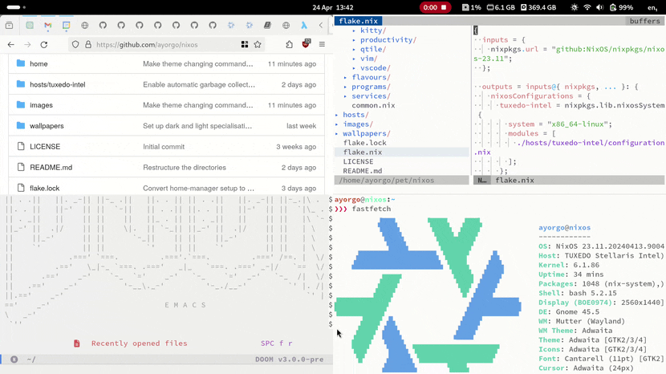

# nixos
## System configuration
```sh
sudo nixos-rebuild switch --flake ~/pet/nixos/hosts#tuxedo-intel
```

## Home configuration
```sh
home-manager switch --flake ~/pet/nixos/home/flavours/dark
```
```sh
home-manager switch --flake ~/pet/nixos/home/flavours/light
```
### Theme toggle
I made the above commands (plus some other stuff) run by a service that watches the `dconf` `color-scheme` key change:  

